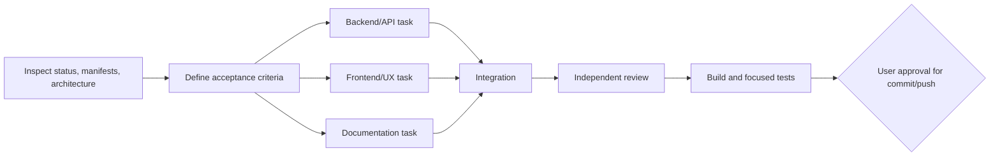

# AGENTS.md — Phishion

## Mission
Phishion is a phishing-analysis web app. Authenticated users submit URLs to VirusTotal, view reputation results, and have scans associated with their account. A SecurityTrails endpoint supports domain/subdomain discovery.

## Architecture
- `backend/app.py`: Flask API, Google OAuth, SQLAlchemy models, VirusTotal and SecurityTrails integrations.
- `frontend/pages/`: Next.js 12 Pages Router entry points.
- `frontend/pages-sections/`: feature UI and client-side API calls.
- `frontend/components/` and `frontend/styles/`: Material UI 4 / Creative Tim component system.
- `compose.yml`: frontend, backend, and PostgreSQL services.

Request flow: browser (`localhost:3000`) -> Flask (`localhost:4000/api/*`) -> PostgreSQL and external threat-intelligence APIs. Authentication uses a Flask session cookie; browser requests that need auth must set `credentials: "include"`.

## Runtime contracts
Required backend environment variables:
- `DATABASE_URL`
- `SECRET_KEY`
- `GOOGLE_CLIENT_ID`, `GOOGLE_CLIENT_SECRET`
- `VIRUSTOTAL_API_KEY`
- `SECURITYTRAILS_API_KEY`

Frontend API configuration:
- `NEXT_PUBLIC_API_URL` (default `http://localhost:4000`)
- `NEXT_PUBLIC_BACKEND_NAME` (default `api`)

Never hardcode credentials, database passwords, API keys, or OAuth secrets. Do not read or commit `.env*` files. Preserve the environment-variable contract in code and Compose.

## Development commands
```bash
# Frontend
cd frontend
npm install
npm run dev
npm run build

# Backend (use a virtual environment)
python -m venv .venv
.venv/bin/pip install -r backend/requirements.txt
FLASK_APP=backend/app.py .venv/bin/flask run --port=4000

# Full stack
docker compose up --build
```

There is currently no meaningful automated test suite: `frontend/package.json` has a placeholder failing `npm test`, and the backend has no tests. At minimum, run `python -m py_compile backend/app.py` and `npm run build`. Add focused tests with new behavior when practical.

## Coding rules
- Inspect `git status` and the relevant diff before editing; preserve pre-existing user changes.
- Keep API responses JSON and return explicit HTTP status codes.
- Require a valid session for user-specific routes.
- Validate request data before database or network operations.
- Add timeouts and handle non-2xx responses for all external HTTP calls.
- Keep API base URL construction consistent with existing `apiUrl/backendname` usage.
- Follow the existing JavaScript style in the touched file; avoid broad template cleanup.
- Use one writer per file during parallel agent work.
- Do not edit generated/vendor outputs: `frontend/.next/`, `frontend/node_modules/`, `backend/__pycache__/`, `frontend/Documentation/assets/`, or generated CSS maps.
- Do not commit or push without explicit user approval.

## Task graph
Use this DAG for non-trivial development:



Edges exist only where output is required. Run independent reads/audits in parallel, but keep sequential implementation in one context when tasks share state. The verifier must be separate from the implementer. Stop after two fix/review loops and report remaining blockers. Commit, push, deploy, account deletion, and other irreversible actions require a human gate.

## Definition of done
- Acceptance criteria are met end to end.
- Existing user changes remain intact.
- No secret or generated artifact is added.
- Frontend production build passes.
- Backend syntax/import checks and any focused tests pass.
- Independent review finds no blocking security or logic issue.
